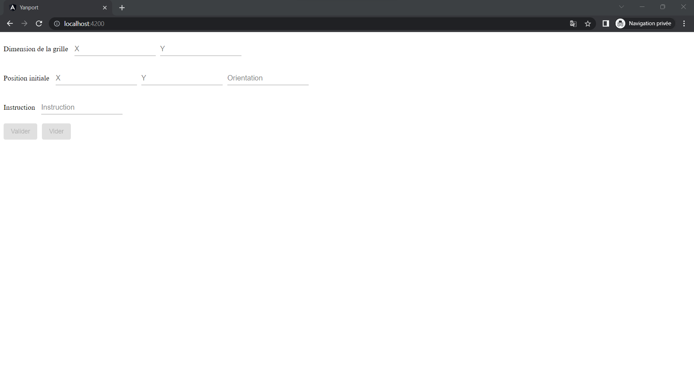
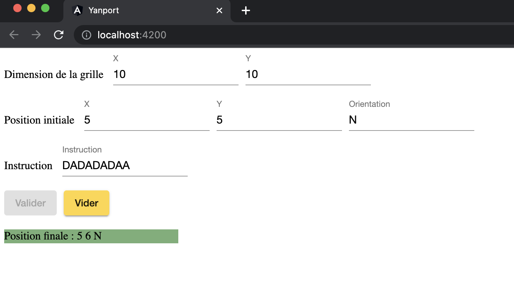

# Yanport

# Installation #
* Cloner le projet
* Se positionner dans le dossier yanport 
* Lancer l'installation des modules avec la commande `npm intall`

## Lancer le projet
* Lancer la commande `npm start` 
* Aller sur  `http://localhost:4200/`
* La fenetre de votre navigateur devrait ressembler à ça 

## Exemple d'execution

## Lancement des tests unitaires
Run `npm run test`
